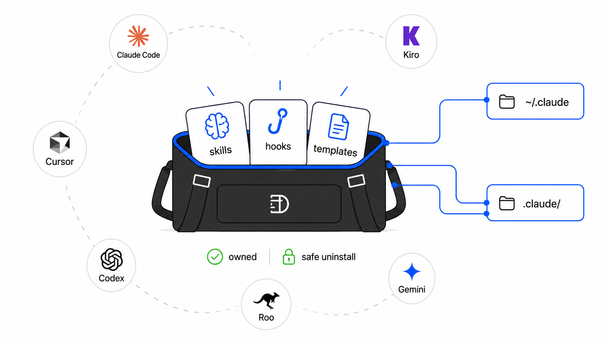

# dufflebag

<p align="center">
  
</p>

`dufflebag` is a one-command installer for Yosef's reusable [Claude Code](https://code.claude.com/docs/en/overview) skills, hooks, and repo templates. It is a [TypeScript](https://www.typescriptlang.org/) CLI for [Node.js](https://nodejs.org/en), built with [pnpm](https://pnpm.io/), [Biome](https://biomejs.dev/), and [Vitest](https://vitest.dev/).

It installs into global `~/.claude` or project-local `.claude/`, edits `settings.json` surgically, and removes only entries it owns. The shipped skills target Claude Code first, while the docs and some skills also account for [Cursor](https://cursor.com/docs), [OpenAI Codex](https://developers.openai.com/codex), [Kiro](https://kiro.dev/docs/steering/), [Gemini CLI](https://geminicli.com/docs/cli/gemini-md/), and [Roo Code](https://docs.roocode.com/features/custom-instructions/).

## Quick start

Install the safe default context guard globally:

```bash
npx ys-dufflebag install --yes --features context-guard
```

Then restart Claude Code so hooks and skills load in the next session.

For a repo-local install that can be committed with the project:

```bash
npx ys-dufflebag install --project
```

## Usage

Run the interactive installer:

```bash
npx ys-dufflebag install
```

Install a specific skill or hook set:

```bash
npx ys-dufflebag install --features readme-editor,refresh-agent-docs
npx ys-dufflebag install --features dedup-guard
npx ys-dufflebag install --features png-to-code
```

Keep an existing install and refresh the copied payload:

```bash
dufflebag update
```

Remove only dufflebag-owned hooks, env keys, payload files, and installed skills:

```bash
dufflebag uninstall
dufflebag uninstall --project
```

Inspect host support and installed state without changing files:

```bash
dufflebag doctor
```

Tune guard and loop behavior through the same `dufflebag*` settings keys the hooks read:

```bash
dufflebag config
dufflebag config --warn 0.15 --block 0.22 --budget 5
dufflebag config --auto-compact-idle 1m
```

Idle auto-compact is off by default. On macOS with Ghostty 1.3+, verified native
hooks for Claude Code, Codex, and Grok bind each session to its exact terminal.
Override one launched agent without changing persistent config, for example
`DUFFLEBAG_CODEX_AUTO_COMPACT=30s codex` or `DUFFLEBAG_GROK_AUTO_COMPACT=off grok`.

## What it installs

`context-guard` is the safe default. `dedup-guard` blocks duplicate TypeScript functions and type shapes at write time where the agent platform supports it. `autonomous-loop` and `speak-response` are macOS-specific conveniences; the loop is driven in-session by `/autorun`. The remaining entries are pure skills with no hooks — no configuration needed, just ask your agent to do the thing (e.g. "convert this PNG to code"). Skills authored by others are bundled too, but credited separately under [Recommended community skills](#recommended-community-skills).

<!-- AUTO:FEATURES:START -->
| Feature | What it does | Runs on |
| --- | --- | --- |
| **context-guard** | Guard long sessions near their context cap and optionally compact idle Claude Code, Codex, or Grok sessions in their exact Ghostty terminal. | 🟢 any OS |
| **autonomous-loop** | A skill that arms the context-guard SessionStart daemon to auto-/compact and resume hands-free once context nears the guardrail and a fresh handoff exists. macOS + Ghostty only (it types into your terminal window). Hook runtime lives under context-guard. | 🔴 macOS + Ghostty |
| **speak-response** | A Stop hook that speaks Claude's prose (code blocks stripped) via the macOS `say` command. macOS only. | 🟡 macOS |
| **dedup-guard** | Block a Write/Edit that pastes a function body or interface/type shape already defined elsewhere in the repo — DRY enforced at the moment of the write. Uses the repo's own TypeScript; deny by default (tune with dufflebagDedupEnforcement). Also wires Cursor (warn) + an AGENTS.md rule for Codex. | 🟢 any OS |
| **png-to-code** | A skill that turns a PNG design (illustration, logo, UI mockup) into SVG/HTML/CSS that measurably converges to a 1:1 match — a decompose → reuse-or-build → render → screenshot-diff → refine loop, plus a rig-first doctrine for animation. Pure skill (no hooks); its diff harness needs Node + Playwright. | 🟢 any OS |
| **github-repo-metadata** | A skill that writes and audits GitHub repository About metadata: concise descriptions, homepage/demo links, and topics/tags grounded in official GitHub guidance. Pure skill (no hooks). | 🟢 any OS |
| **write-a-post** | A skill that writes a portfolio blog post in the owner's exact voice, scaffolds it into the blog data file via a one-command dev script, and generates a matching cover image by driving a real ChatGPT browser conversation through ai-browser-bridge (attaching the likeness photo + an existing cover so the character and flat-2D style stay consistent). Pure skill (no hooks). | 🟢 any OS |
| **readme-editor** | A skill that audits and rewrites README.md, AGENTS.md, CLAUDE.md, Copilot instructions, and llms.txt from repo evidence, with official links for named tools and technologies. Pure skill (no hooks). | 🟢 any OS |
| **refresh-agent-docs** | A skill that refetches current official guidance for AGENTS.md, CLAUDE.md, GEMINI.md, Cursor rules, Kiro steering, Roo rules, and Codex instructions before rewriting repo agent docs. Pure skill (no hooks). | 🟢 any OS |
| **deslop-v2** | The over-engineering companion to deslop: reviews code and repo structure for excess — pass-through wrappers, `??` fallback chains, nested ternaries, grab-bag returns, and over-nested folders/packages — then removes it so the code does exactly what it needs and no more. Use when the user says code is over-engineered, over-abstracted, or too complicated, or asks to simplify, flatten, or cut needless indirection and layers. Pure skill (no hooks). | 🟢 any OS |
| **grill-me-code-style** | A greenfield code-style grilling skill. Interviews the user about how a new project is built, then renders an interactive HTML plan and writes CODE-STYLE.md, formatter config, and AGENTS.md digest on approval. | 🟢 any OS |
| **grill-me-code-style-coach** | Coach real style and structure decisions while code is being built or fixed. | 🟢 any OS |
| **grill-me-code-style-review** | Review a large changeset against its code-style contract and explain only real deviations. | 🟢 any OS |
| **grill-me-code-style-with-docs** | An existing-codebase code-style grilling skill. Uses real code as evidence, fans out sub-agents for repeated patterns, then writes/updates CODE-STYLE.md and the AGENTS.md digest on approval. | 🟢 any OS |
| **grill-me-stack** | Teach and challenge a project's technology choices until their tradeoffs are explainable. | 🟢 any OS |
| **planpage** | A skill for rendering agent plans, review gates, and reports as beautiful interactive HTML pages using the open-source planpage package. | 🟢 any OS |
| **web-perf-ci** | A skill that wires automated performance gates into a website's CI/CD: a Lighthouse CI budget check on every PR (lab), a Chrome UX Report (CrUX) real-user field check after deploy, and an optional web-vitals RUM snippet — all enforcing Core Web Vitals budgets (LCP, INP, CLS). It interviews the repo to detect the stack and run mode, then writes lighthouserc, the GitHub Actions workflows, and zero-dep CrUX + PSI checkers. Pure skill (no hooks); the checks need Node 18+ and a free Google API key (Chrome UX Report + PageSpeed Insights APIs). | 🟢 any OS |
| **cws-listing-seo** | A skill that optimizes Chrome Web Store listing copy (name, summary, Overview) and marketing-site GEO using official Chrome/Google guidance. Ships a zero-dep validator for limits + Keyword Spam heuristics; CWS keyword volume stays manual/browser research (no official free API). Pure skill (no hooks). | 🟢 any OS |
| **make-a-trailer** | A skill that directs a cinematic, viral-ready vertical trailer for any project: it reads the repo's own docs to derive the story, consults ChatGPT (GPT-5.5 Thinking) over ai-browser-bridge to write the transcript + storyboard, batch-generates the keyframes as ChatGPT images, animates them with Higgsfield or Flow/Veo, produces voiceover + music (ElevenLabs → Higgsfield → local synth), and assembles a 9:16 master + 16:9/1:1/4:5 cuts with ffmpeg — behind two planpage approval gates and a resumable generation manifest. macOS + Chrome (ai-browser-bridge), the Higgsfield MCP, and ffmpeg required. Pure skill (no hooks). | 🟡 macOS |
| **web-best-practices** | Audit and fix semantics, accessibility, assets, security, SEO, and machine readability. | 🟢 any OS |
| **organized-commits** | Organize Git changes into atomic, evidence-backed commits and safely push or consolidate work when requested. | 🟢 any OS |
| **finish-and-ship** | Close implementation, verification, Git history, push, hosted checks, and handoff without hidden leftovers. | 🟢 any OS |
| **preview-and-prove** | Launch the real product surface and prove a user-visible flow through browser, network, and persisted-state evidence. | 🟢 any OS |
| **reuse-first-audit** | Search internal code, platform primitives, and primary ecosystem sources before deciding to build new surface. | 🟢 any OS |
| **agent-session-auditor** | Privacy-safe local session coverage, prompt extraction, fuzzy clustering, and evidence-backed skill prioritization. | 🟢 any OS |
| **sync-agent-skills** | Synchronize canonical skills through receipt-backed native formats and prove parity across detected supported agents. | 🟢 any OS |
| **env-config-contract** | Consolidate environment reads into fail-loud schema boundaries without leaking secrets across trust zones. | 🟢 any OS |
| **mcp-oauth-onboarding** | Install an MCP at the intended scope, complete OAuth, reload the agent, and prove it with a harmless tool call. | 🟢 any OS |
| **rtl-ui-audit** | Audit and verify real right-to-left layout, bidi content, directional assets, interaction, and accessibility. | 🟢 any OS |
| **deploy-and-prove** | Deploy or publish an immutable source identity and prove the provider, live runtime, and changed behavior serve it. | 🟢 any OS |
| **coordinate-worktrees** | Safely reconcile overlapping branches and worktrees with backups, intent-aware integration, and reachability proof. | 🟢 any OS |
| **capture-workflow** | Turn a proven task into the smallest reusable skill, script, template, test, or runbook and replay it cleanly. | 🟢 any OS |
| **finish-agent-sessions** | Reconcile interrupted work across agent histories with current repositories, then finish or honestly classify every task. | 🟢 any OS |
<!-- AUTO:FEATURES:END -->

## Recommended community skills

<!-- AUTO:SKILLS:START -->
These skills ship in the bag for convenience — installable the same way (`npx ys-dufflebag install --features <id>`) — but they are **authored by others**, not by dufflebag. Full credit and upstream sources:

| Skill | What it does | By |
| --- | --- | --- |
| **deslop** | Reviews code readability first, then applies approved cleanup that makes the full pipeline understandable in seconds. Use when the user says "deslop", "make this readable", "make this less AI", "second pass", "clean this up", "rename for clarity", "show before and after", or asks to improve code comprehension across React, TypeScript, backend, folders, imports, hooks, or functions. | [Mike Cann](https://github.com/mikecann/agent-skills) |
| **grill-me** | Interview the user relentlessly about a plan or design until reaching shared understanding, resolving each branch of the decision tree. Use when user wants to stress-test a plan, get grilled on their design, or mentions "grill me". | [Matt Pocock](https://github.com/mattpocock/skills) |
| **grill-with-docs** | Grilling session that challenges your plan against the existing domain model, sharpens terminology, and updates documentation (CONTEXT.md, ADRs) inline as decisions crystallise. Use when user wants to stress-test a plan against their project's language and documented decisions. | [Matt Pocock](https://github.com/mattpocock/skills) |

> `grill-me-code-style` and `grill-me-code-style-with-docs` are dufflebag-original skills that build on Matt Pocock's grilling pattern — they stay in the owned catalog above.
<!-- AUTO:SKILLS:END -->

## Scope

This repository is the source of truth for dufflebag-owned skills and hooks. It is not a general agent marketplace, does not install arbitrary third-party skill folders, and does not own runtime behavior for every agent listed above. When a platform cannot enforce a hook before an edit, dufflebag documents the limit and provides the closest check it can support.

The hook payload is intentionally small: compiled JavaScript, Node built-ins, and dufflebag's own payload helpers. The CLI can use dependencies; hook files should stay zero-dependency.

## Repo docs

- [AGENTS.md](AGENTS.md) — repo conventions, ownership, and validation commands for coding agents.
- [PROJECT.md](PROJECT.md) — product direction and repository purpose.
- [CONTEXT.md](CONTEXT.md) — domain context.
- [LANGUAGE.md](LANGUAGE.md) — naming and terminology.
- [templates/mdFiles/CODE-STYLE.md](templates/mdFiles/CODE-STYLE.md) — reusable code-style template installed into other repos.
- [docs/adr/current/](docs/adr/current/) — accepted architecture decisions.

## Official references

- [Claude Code overview](https://code.claude.com/docs/en/overview)
- [Claude Code memory](https://code.claude.com/docs/en/memory)
- [AGENTS.md convention](https://agents.md/)
- [OpenAI Codex AGENTS.md guide](https://developers.openai.com/codex/guides/agents-md)
- [Cursor rules](https://cursor.com/docs/rules)
- [GitHub README guide](https://docs.github.com/en/repositories/managing-your-repositorys-settings-and-features/customizing-your-repository/about-readmes)
- [GitHub Actions](https://docs.github.com/en/actions)
- [npm trusted publishing](https://docs.npmjs.com/trusted-publishers/)

## Development

```bash
pnpm install
pnpm generate-readme
pnpm test
pnpm typecheck
pnpm build
pnpm verify
```

`pnpm generate-readme` rewrites only the marked feature and skill sections above from `src/catalog/featureCatalog.ts` and `src/skills/*/SKILL.md`. The pre-commit hook runs it automatically and stages the updated README.

## License

[MIT](./LICENSE) © Yosef Hayim Sabag
